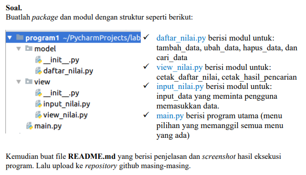
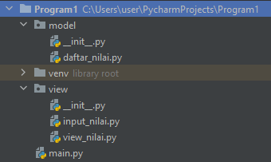
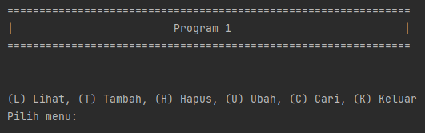
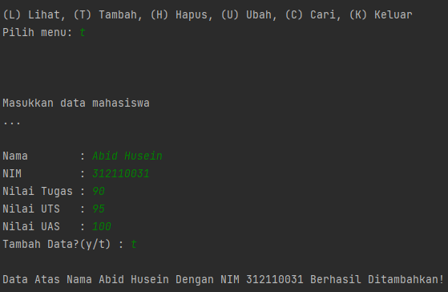
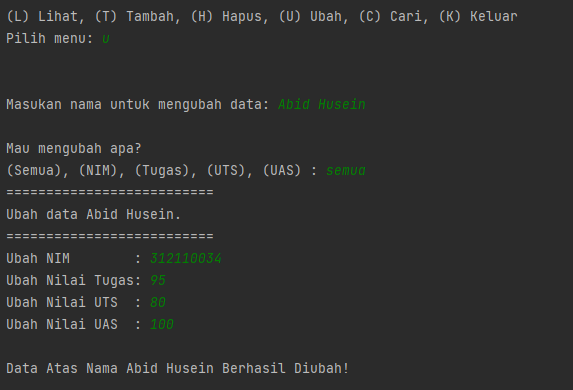
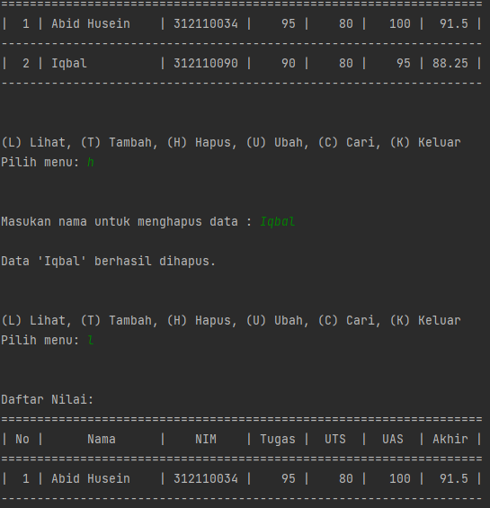
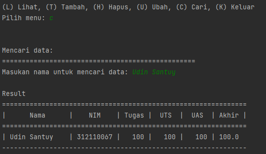

# UAS Bahasa Pemograman

### Soal


### Program Module


### Penjelasan

### model

daftar_nilai.py

*-Tambah_Nilai*
- Membuat variabel dict dengan nama ```data = {}``` dengan nilai kosong
- lalu terdapat function ```def tambah_data():``` yang berfungsi untuk Menambah Data Mahasiswa
```bash
from view.input_nilai import *

data = {}

# Menambahkan data
def tambah_data():
    global data
    ulangi = 'y'
    while ulangi =='y':
        nama = input_nama()
        nim = input_nim()
        nilai_tugas = input_ntugas()
        nilai_uts = input_nuts()
        nilai_uas = input_nuas()
        nilai_akhir = nakhir()
        data[nama] = [nama, nim, nilai_tugas, nilai_uts, nilai_uas, nilai_akhir]
        ulangi = (input('Tambah Data?(y/t) : '))

        if ulangi == 't':
            print('\nData Atas Nama',nama, 'Dengan NIMt',nim, 'Berhasil Ditambahkan!')
            return data
```

- lalu terdapat function ```def tambah_data():``` yang berfungsi untuk Menambah Data Mahasiswa
```bash
# Mengubah data
def ubah_data():
    nama = input("Masukan nama untuk mengubah data: ")
    if nama in data.keys():
        print("\nMau mengubah apa?")
        sub_data = input("(Semua), (NIM), (Tugas), (UTS), (UAS) : ")
        if sub_data.lower() == "semua":
            print("==========================")
            print("Ubah data {}.".format(nama))
            print("==========================")
            data[nama][1] = input("Ubah NIM        : ")
            data[nama][2] = int(input("Ubah Nilai Tugas: "))
            data[nama][3] = int(input("Ubah Nilai UTS  : "))
            data[nama][4] = int(input("Ubah Nilai UAS  : "))
            data[nama][5] = data[nama][2] *30/100 + data[nama][3]*35/100 + data[nama][4] *35/100
            print("\nData Atas Nama", nama, "Berhasil Diubah!")

        elif sub_data.lower() == "nim":
            data[nama][1] = input("\nNIM:")
            print("\nData Atas Nama", nama, "Berhasil Diubah!")
        elif sub_data.lower() == "tugas":
            data[nama][2] = int(input("\nNilai Tugas: "))
            data[nama][5] = data[nama][2] *30/100 + data[nama][3]*35/100 + data[nama][4] *35/100
            print("\nData Atas Nama", nama, "Berhasil Diubah!")
        elif sub_data.lower() == "uts":
            data[nama][3] = int(input("\nNilai UTS: "))
            data[nama][5] = data[nama][2] *30/100 + data[nama][3]*35/100 + data[nama][4] *35/100
            print("\nData Atas Nama", nama, "Berhasil Diubah!")
        elif sub_data.lower() == "uas":
            data[nama][4] = int(input("\nNilai UAS: "))
            data[nama][5] = data[nama][2] *30/100 + data[nama][3]*35/100 + data[nama][4] *35/100
            print("\nData Atas Nama", nama, "Berhasil Diubah!")
        else:
            print("\nmenu tidak ditemukan.")

    else:
        print("'{}' tidak ditemukan.".format(nama))
```

- lalu ada function ```def hapus_data():``` yang berfungsi untuk menghapus data yang telah diinput sebelumnya
```bash
# Menghapus data
def hapus_data():
    nama = input("Masukan nama untuk menghapus data : ")
    if nama in data.keys():
        del data[nama]
        print("\nData '{}' berhasil dihapus.".format(nama))
    else:
        print("'{}' tidak ditemukan.".format(nama))
```

- function ```def cari_data():``` yang berfungsi untuk mancari data yang sudah diinput
```bash
# Mencari data
def cari_data():
    print("Mencari data: ")
    print("=================================================")
    nama = input("Masukan nama untuk mencari data: ")
    print('\nResult')
    print("==============================================================")
    print("|      Nama      |    NIM    | Tugas |  UTS  |  UAS  | Akhir |")
    print("==============================================================")
    if nama in data.keys():
        print("| {0:14} | {1:9} | {2:5} | {3:5} | {4:5} | {5:5}"
            .format(nama, data[nama][1], data[nama][2], data[nama][3], data[nama][4], data[nama][5]))
        print('--------------------------------------------------------------')
    else:
        print("'{}' tidak ditemukan.".format(nama))
```

*-view*

input_nilai.py

- membuat function ```def input_nama():``` berfungsi untuk menginputkan nama
```bash
def input_nama():
    print("\nMasukkan data mahasiswa")
    print("...")
    global nama
    nama = input("\nNama        : ")
    return nama
```

- membuat fuction ```def input_nim```berfungsi menginput NIM
```bash
def input_nim():
    global nim
    nim = input("NIM         : ")
    return nim
```

- membuat function ```def input_ntugas():```berfungsi untuk menginput nilai tugas
```bash
def input_ntugas():
    global nilai_tugas
    nilai_tugas = int(input("Nilai Tugas : "))
    return nilai_tugas
```

- membuat fucntion```def input_nuts():```berfungsi untuk menginput nilai UTS
```bash
def input_nuts():
    global nilai_uts
    nilai_uts = int(input("Nilai UTS   : "))
    return nilai_uts
```

- membuat function```def input_nuas():```berfungsi untuk meginput nilai UAS
```bash
def input_nuas():
    global nilai_uas
    nilai_uas = int(input("Nilai UAS   : "))
    return nilai_uas
```

- membuat function```def nakhir():``` berfungsi untuk menjumlahakn antara nilai Tugas, UTS, UAS menjadi nilai rata-rata
```bash
def nakhir():
    global nilai_akhir
    nilai_akhir = (nilai_tugas)*30/100 + (nilai_uts)*35/100 + (nilai_uas)*35/100
    return nilai_akhir
```

view_nilai.py

- deklarasikan fungsi ``def lihat_data():`` Kita menggunakan kondisi percabangan if, ambil data dari ``data``
- lalu cetak ``print()``


Lalu yang terakhir kita eksekusi file main.py
```bash
from model.daftar_nilai import *
from view.view_nilai import *

#Mulai
print("===============================================================")
print("|                           Program 1                         |")
print("===============================================================")

while True:
    print("\n")
    menu = input("(L) Lihat, (T) Tambah, (H) Hapus, (U) Ubah, (C) Cari, (K) Keluar\nPilih menu: ")
    print("\n")

    # menu
    if menu.lower() == 't':
        tambah_data()

    elif menu.lower() == 'c':
        cari_data()

    elif menu.lower() == 'l':
        lihat_data()

    elif menu.lower() == 'u':
        ubah_data()

    elif menu.lower() == 'h':
        hapus_data()

    # Keluar
    elif menu.lower() == 'k':
        break

    else:
        print("Upss ada yang salah, silahkan cek kembali.")

```

### Output

### kolom Perintah


### Tambah Data


### Mengubah Data


### Lihat Data


### Hapus Data


### Cari Data


